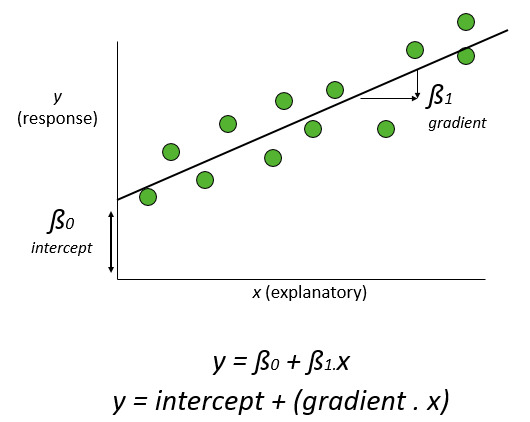
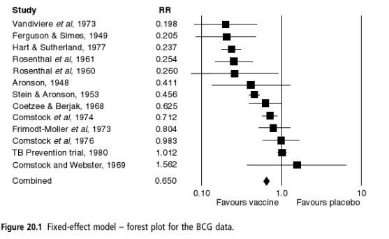
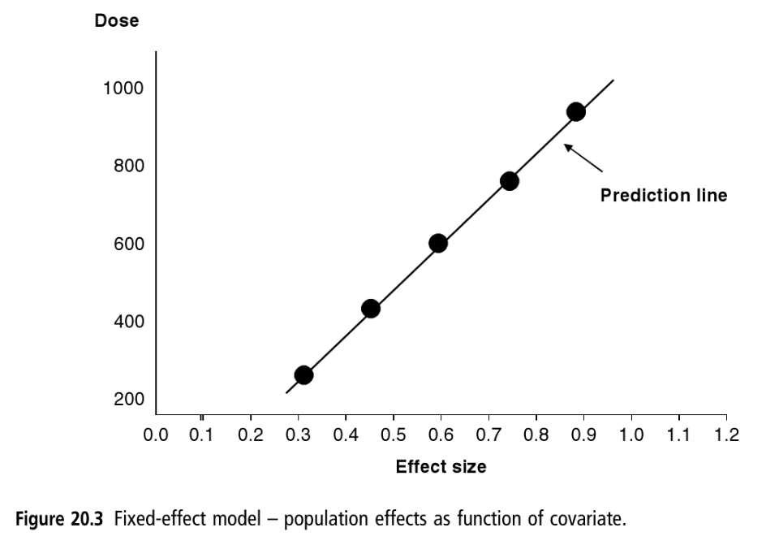
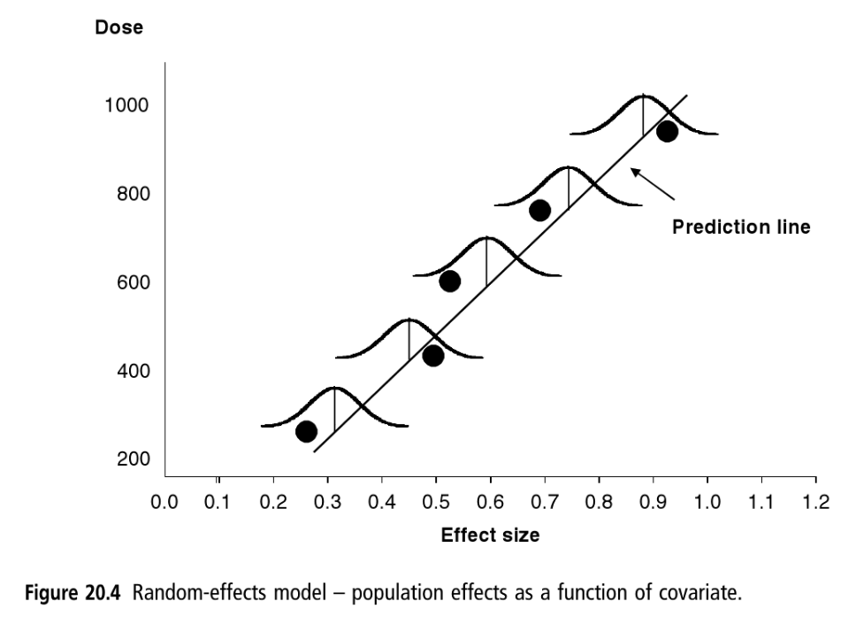

```{r setup, include=FALSE}
knitr::opts_chunk$set(echo = TRUE)
```

# Introduction
You are probably familiar with regression from undergraduate statistical courses, where you have a response variable (also known as the dependent variable, plotted on the vertical y-axis) and an explanatory variable (also known as the covariate, plotted on the horizontal x-axis). A straight line linear regression can be calculated in R using the `lm` (linear model) command. Note that ANOVA and regression are both linear models; in ANOVA the explanatory variable is a categorical `factor`, whereas in regression the explanatory variable is continuous. In both cases the linear model can be represented as:

$$y = x + \epsilon$$
wheree $y$ is your response variable, $x$ your explanatory variable, and $\epsilon$ the variation (error) around the observations. In multiple regression there can be more than one explanatory variables, or for ANCOVA a mixture of continuous and categorical explanatory variables. More formally, _x_ is actually a "model matrix" of two columns (a column of 1's and a column of the _x_ explanatory variables). The columns of 1's all end up with the same value, the intercept, so you may sometimes see a standard regression model written as:

$$y = \beta_0 + \beta_1 + \epsilon$$
where $\beta_0$ is the intercept and $\beta_1$ is the slope of the regression line:



The overall aim of this practical is to help you understand how meta-regression differs from conventional meta-analysis. Specific objectives are to:

1. Compare meta-regression with conventional linear regression
2. Undertake a fixed-effect meta-regression semi-manually using the linear model, `lm()`, function
3. Analyse the same data using `metafor` and visualise the results
4. Explain random-effects meta-regression, analyse and visualise the results
5. Test the robustness of model assumptions

We will again use data from Borenstein (page 190). Whilst this is again a medical, rather than ecological, example, it is relatively simple, and you can compare your results directly with those in the textbook.

# 1. How does meta-regression differ from conventional regression?
In a standard regression each point on the graph represents an individual replicate within one experiment, and the response is a measured variable (e.g. species diversity, plant growth etc.). In contrast, in meta-regression the two main differences are:

* __Unit of analysis__ such that each observation represents a different _study_ rather than a replicate within a study;
* __Dependent variable__ is now and _effect size_ from that study, rather than in the original experimental units;
* __Explanatory variable__ or covariate is now at the level of the individual study, rather than the replicate within a study.

The theory behind a meta-regression is identical to that of the other meta-analyses you have already encountered. The overall meta-regression statistics are derived from a weighted average of the individual studies, with the weights depending on the sample sizes and variance in each study. Meta-regression can be undertaken as either a fixed- or random-effects analysis.  One way of thinking about this is that in a fixed-effects meta-regression, we assume the same slope and intercept for all the studies, whilst in a random-effects meta-regression we allow variation in these values between the studies. Just like conventional linear models, we can have more than one predictor, for example $x$ and $x^2$ to fit a polynomial curve. Likewise, we can have a mixture of continuous and categorical (R `factor`) predictors, which in meta-regression is usually referred to as a _sub-group analysis__.

# 2. Fixed-effect meta-regression; manual example
## 2.1 Meta-analysis without meta-regression
As before, we will begin with a simple fixed-effect meta-regression, work through the calculations by hand, before showing you how to automate the process. The example is a "classic" dataset that you will find in a lot of the meta-analysis literature. Unfortunately it is a medical rather than ecological dataset, but it is straightforward to understand. Full hand calculations based on this dataset are shown in Borenstein et al. Chapter 20. The data are based on 13 studies of the BCG vaccine against tuberculosis and its effectiveness, and the forest plot from a standard fixed-effect meta-analysis is shown below:



The effect-size is measured as risk-ratios (RR) where a RR of 1.0 indicates no effect of the vaccine, less than 1.0 indicates that the vaccine reduces tuberculosis, and values greater than 1.0 suggest the vaccine would make the disease worse. The above meta-analysis gives a risk ratio of 0.650, with a 95% confidence interval of 0.601 to 0.704. This suggests that the BCG vaccine reduces the risk of TB by approximately 30% to 40%, which is perhaps to be expected (just as well, as I received the BCG vaccine when I was at school!).

What is more surprising is the amount of variation shown by the fixed-effect meta-analysis. Indeed, several studies suggest an 80% reduction in risk, whilst on (Cormstock and Webster) suggested an odds ratio of 1.56, i.e. an _increase_ in risk of 56%.  What is going on? The BCG vaccine is more effective when it is **stored under cold conditions**, as the drug becomes less active when exposed to warmth or sunlight. (This issue is highly relevant to the new Covid19 vaccines.) Perhaps temperature accounts for the differences observed in the above plot?

**This is where meta-regression becomes useful.** Berkey _et al._ (1995) did not know the actual storage temperature of the BCG vaccine, or whether it had been exposed to sunlight, but inferred it for the above studies from latitude: higher latitudes are generally cooler and have less sunlight.

## 2.2 Risk ratios for the BCG dataset
Load up the `mosaic` and `metafor` libraries, then read in the BCG dataset, adapted from Borenstein Chapter 20, and examine it:

```{r load_metafor, echo=FALSE, message=FALSE, warning=FALSE}
library(metafor)
library(mosaic)
```
```{r read and check the BCG data}
bcg <- read.csv("Data/Borenstein_p190.csv")
print(bcg)
```

In the output table, `tpos` is the number of vaccinated individuals that still caught TB, `tneg` is the number of vaccinated individuals that did not catch TB, whilst the equivalent figures for the non-vaccinated controls are in `cpos` and `cneg`. The lattitude is in `ablat` (absolute latitude north or south in degrees).

First, we calculate the risk ratios (RR), then take their logs:

```{r RR and logs}
ttot <- bcg$tpos + bcg$tneg
ctot <- bcg$cpos + bcg$cneg
RR <- (bcg$tpos/ttot) / (bcg$cpos/ctot)
lnRR <- log(RR)
```

*Why take logs?* We have seen this before, but it is useful to repeat. Basically it makes ratios in the same units, irrespective of which way round they are, with the sign (+ve or -ve) showing the direction:

3/5 = 0.600

5/3 = 1.667

whereas ln (natural logs, or `log` function in R)

log(3/5) = -0.511

log(5/3) =  0.511

The latter is much easier and more consistent to compare.

For each study, the variance of the risk ratios can be calculated as:

$$V_{RR}=\frac{1}{Vaccine_{TB}}-\frac{1}{Vaccine_n}+\frac{1}{Control_{TB}}-\frac{1}{Control_n}$$

```{r variance of RR}
VRR <- (1/bcg$tpos - 1/ttot) + (1/bcg$cpos - 1/ctot)
print(cbind(RR, lnRR, bcg$ablat, VRR))
```

Remember that the weight applied to each study is smaller for studies with a large $V_{RR}$ so:

$$W=\frac{1}{V_{RR}}$$

## 2.3 Weighted linear regression
Now we can undertake a standard linear regression using the `lm()` function, to compare the logged risk ratios with absolute latitude. We want to give some of the studies greater weight than others, so we use the `weights` option to `lm()`:

```{r lnRR and latitude}
bcg.lm <- lm(lnRR ~ bcg$ablat, weights = 1/VRR)
summary(bcg.lm)
```

You can see that the intercept ln(RR) when the latitude is zero is `r round(bcg.lm$coefficients[[1]],3)` whilst the slope is `r round(bcg.lm$coefficients[[2]],3)` which is negative, suggesting that rates of TB are higher amongst vaccinated individuals near the warm equator than in higher latitudes further north or further south, that are cooler. (**Note**: the `lm` summary shows the results of t-distribution tests for significance, whereas meta-regression usually uses Z-distributions, so the p-values listed above are not necessarily reliable.)

# 3. Fixed-effect analysis with `metafor`
## 3.1 Fixed-effect meta-analysis, ignoring absolute latitude
Now let's repeat the above analysis with the aid of `escalc` and `rma` which would be the more usual, and much quicker, way of doing the analysis. There is no difference in the use of `escalc`, and you simply have to specify that the `measure="RR"` to ask it to calculate the risk ratios. 

```{r fixed escalc metafor}
bcg.eff <- escalc(measure="RR", ai=tpos, bi=tneg, ci=cpos, di=cneg, data=bcg)
summary(bcg.eff)
summary(bcg.eff, transf=exp)
```

Two fairly long summary tables are shown, because they include the 95% upper and lower confidence intervals etc.  They are identical except the first shows the log risk ratios under the `yi` columns, whereas the second shows the original risk ratios, back-transformed via the exponential option.

Now use the `rma` function as usual for the meta-analysis.  First, let's look at a standard fixed-effect meta-analysis, **ignoring the potential effect** of the absolute latitude. Notice that in the `forest()` plot function we have added the argument `order="obs"` to rank the display of studies according the the magnitude of their effect sizes:

```{r fixed effect no latitude}
bcg_fe.rma <- rma(yi, vi, data=bcg.eff, method="FE")
forest(bcg_fe.rma, atransf = exp, showweights=TRUE, order="obs")
```
## 3.2 Meta-regression includes absolute latitude
However, as this is a meta-regression, we need to include the covariate or "moderator", absolute latitude (`ablat`), which is done via the `mods` option.  Again, as `rma` defaults to random-effects, we need to state that we want fixed-effects by adding the `method="FE"` argument:

```{r fixed metafor}
bcg_fe_metareg.rma <- rma(yi, vi, mods=~ablat, data=bcg.eff, method="FE")
print(bcg_fe_metareg.rma)
```

The intercept and gradient (labelled `intrcpt` and `ablat` respectively) are the same as we calculated earlier by hand, but their p-values are now based on Z-distribution tests (labelled `zval`) rather than the t-distribution from a conventional `lm` command. There is also an overall test from the Q-statistic labelled `Test of moderators`.  Notice also that there is a Q-statistic labelled `Test for residual heterogeneity` which is also significant. This indicates that even with latitude included in the meta-regression, some of the between-studies variance (i.e. the scatter around the studies in the regression line) is still unexplained.

Our regression line is therefore:

$$ln(RR) = 0.3436 -0.0292.latitude$$

which can be visualised via `gf_point()`. Try with and without the `gf_refine()` option. You can see how this alters the scaling of the y-axis to make the logarithmic scale clearer. Remember that meta-regressions of odds-ratios and risk ratios are calculated on ln(OR) or ln(RR), so we get a better representation if the y-axis is shown on a log scale.:

```{r basic plot of meta-regression}
gf_point(exp(yi) ~ ablat, data=bcg.eff) %>%
   gf_labs(x = "Absolute latitude", y = "Risk ratio")  %>% 
   gf_refine(coord_trans(y = "log"))
```

Try making additonal modifications to the plot, e.g. changing the layout to `theme_classic()` to make the axis lines clearer and remove the grey background.

This plot is not particularly informative, as it does not include the predicted regression line, and it would be useful to put a dotted horizontal line where the risk ratio equals 1.0, as that represents no difference in the effect (RR) as a result of absolute latitude.

The predicted risk ratios, and their upper and lower 95% confidence intervals, can be calulated via `predict` function against the `bcg_fe.rma` that we calculated earlier. For ease of use later, we will use the `data.frame()` function to assemble the predicted values, the absolute latitude and the effect size into a single table:

```{r predicted regression plus ci}
# Calculate predicted regression line, plus 95% CI
preds <- predict(bcg_fe_metareg.rma, newmods=bcg$ablat, transf=exp)

# Create a dataframe that includes predictions, original data, and effect size
preds_ablat_eff <- data.frame(preds, ablat = bcg$ablat, yi = bcg.eff$yi)
head(preds_ablat_eff)
```

Now we can easily add these lines to our plot. The option `lty = 2` sets the linetype to a "dashed" line. See <http://www.cookbook-r.com/Graphs/Shapes_and_line_types/> for a list of shape and line codes.  Please ask if the following lines of code are unclear:

```{r add meta-regression line, warning=FALSE}
gf_point(exp(yi) ~ ablat, data=preds_ablat_eff) %>%  
   gf_labs(x = "Absolute latitude", y = "Risk ratio") %>%
   gf_hline(yintercept = 1.0, lty = 2) %>% 
   gf_line(pred ~ ablat) %>% 
   gf_line(ci.ub ~ ablat, lty = 2) %>% 
   gf_line(ci.lb ~ ablat, lty = 2) %>% 
   gf_refine(coord_trans(y = "log"))
```

Finally, let's modify the plotting code so the point size of the studies bigger if they carry more weight, and also change the y-axis tick-marks to 0.2, 0.4, 0.6 etc.  Remember that the weights are calculated simply as 1/se for each study:

```{r completed meta-regression plot, warning=FALSE}
# Recall that the bigger the variance the lower the weight, so we use
# reciprocal value
wi <- 1 / sqrt(bcg.eff$vi)
# The 0.5 and 8.0 multiplier values work reasonably well but sometimes you
# may need trial-and-error to get a nice visualisation
point_size  <- 0.5 + 8.0 * (wi - min(wi))/(max(wi) - min(wi))

gf_point(exp(yi) ~ ablat, size = point_size, data=preds_ablat_eff) %>%  
   gf_labs(x = "Absolute latitude", y = "Risk ratio") %>%
   gf_hline(yintercept = 1.0, lty = 2) %>% 
   gf_line(pred ~ ablat) %>% 
   gf_line(ci.ub ~ ablat, lty = 2) %>% 
   gf_line(ci.lb ~ ablat, lty = 2) %>% 
   gf_refine(coord_trans(y = "log")) %>% 
   gf_refine(scale_y_continuous(breaks = seq(from=0.2, to=1.6, by=0.2)))
```

It would have been more convenient if there was a `ggformula` function that handled `rma` outputs automatically.  You can also read how to create this type of meta-regression plot at [the metafor website](http://www.metafor-project.org/doku.php/plots:meta_analytic_scatterplot)

# 4. Random-effects meta-regression
## 4.1 Fixed- vs Random-effects meta-regression
As you will probably have realised by now, it is more appropriate in general to do a random-effects meta-regression.  There was a suggestion of unexplained variation earlier, when we looked at the Q-statistics output from the `rma` model.  In a fixed-effect meta-regression, we assume that there is one true effect, in the way that the studies respond to the explanatory variable, and any differences are just due to observation error etc.:



In contrast, in a random-effects meta-regression, we allow for differences between the studies, and with different "population" estimates, which then translate into the observed "sample" values for each study:



If all the studies used exactly the same moderator values, covering the same range etc., then a fixed-effect meta-regression is probably appropriate.  However, in reality this is **unlikely to be true**, and a random-effects meta-regression would be better for data collected via typical systematic reviews.

Again, this is straightforward to implement via `metafor`. We do not need to specify the `method` option as it defaults to random effects.

## 4.2 Random-effects meta-analysis, ignoring absolute latitude
As before, let's begin with a standard forest plot, but without the moderators:

```{r rand-effects no moderator}
bcg_re.rma <- rma(yi, vi, data=bcg.eff, measure="RR")
forest(bcg_re.rma, atransf = exp, showweights=TRUE, order="obs")
```

## 4.3 Random-effects meta-regression includes absolute latitude
To do a meta-regression we still need to include the moderator, the absolute latitude `ablat`.

```{r random effects meta-regression}
bcg_re_metareg.rma <- rma(yi, vi, mods=~ablat, data=bcg.eff, measure="RR")
print(bcg_re_metareg.rma)
```

You'll notice that the gradient is significant, but the intercept is no longer significant. **On your own**: Create a plot of absolute latitude vs the log(RR), as you did in the fixed-effect meta-regression (using both the gradient and intercept).  What do you infer about the relative sizes of the circles (weightings) for the two analyses?

# 5. Test model assumptions
QQ plots provide the simplest method of checking model assumptions; these order the residuals from each study in rank order and compare with the residuals if the model assumptions (normal distribution of errors) had been met. Ideally, most of the points should fall on the leading diagonal line, within the 95% confidence intervals. You have actually created 4 models in this practical: fixed-effect with- and without absolute latitude, and random effects with and without absolute latitude. Create 4 QQ plots, and decide which method of analysis is most appropriate for this dataset.:

```{r qqnorm for meta regression}
qqnorm(bcg_fe.rma, main="Fixed-effect, no moderators")
qqnorm(bcg_re.rma, main="Random-effect, no moderators")
qqnorm(bcg_fe_metareg.rma, main="Fixed-effect, plus latitude")
qqnorm(bcg_re_metareg.rma, main="Random-effect, plus latitude")
```

Looking at your qqnorm plots, which was the best meta-analysis? Thinking about your random-effects meta-regression, what other moderators could be included, and how? (clue, like a multiple regression or ANCOVA).

# Summary
Meta-regression provides a very flexible approach to including additional continuous or categorical "moderators" into a meta-analysis. More advanced methods of undertaking meta-regression is also covered in Chater 9 of Cumming, and Chapter 20 of Borenstein et al.
