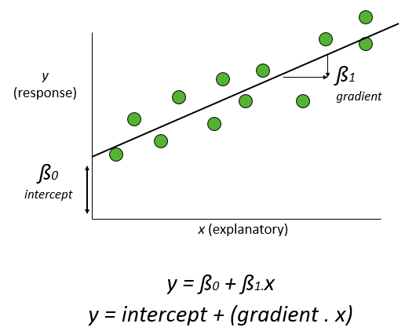

```{r setup, include=FALSE}
library(learnr)
library(metafor)
library(mosaic)
bcg <- read.csv("www/Borenstein_p190.csv")
knitr::opts_chunk$set(echo = FALSE)
```


## Introduction
You are probably familiar with regression from undergraduate statistical courses, where you have a response variable (also known as the dependent variable, plotted on the vertical y-axis) and an explanatory variable (also known as the covariate, plotted on the horizontal x-axis). A straight line linear regression can be calculated in R using the `lm` (linear model) command. Note that ANOVA and regression are both linear models; in ANOVA the explanatory variable is a categorical `factor`, whereas in regression the explanatory variable is continuous. In both cases the linear model can be represented as:

$$y = x + \epsilon$$
wheree $y$ is your response variable, $x$ your explanatory variable, and $\epsilon$ the variation (error) around the observations. In multiple regression there can be more than one explanatory variables, or for ANCOVA a mixture of continuous and categorical explanatory variables. More formally, _x_ is actually a "model matrix" of two columns (a column of 1's and a column of the _x_ explanatory variables). The columns of 1's all end up with the same value, the intercept, so you may sometimes see a standard regression model written as:

$$y = \beta_0 + \beta_1 + \epsilon$$
where $\beta_0$ is the intercept and $\beta_1$ is the slope of the regression line:



### How does meta-regression differ from conventional regression?
In a standard regression each point on the graph represents an individual replicate within one experiment, and the response is a measured variable (e.g. species diversity, plant growth etc.). In contrast, in meta-regression the two main differences are:

* __Unit of analysis__ such that each observation represents a different _study_ rather than a replicate within a study;
* __Dependent variable__ is now and _effect size_ from that study, rather than in the original experimental units;
* __Explanatory variable__ or covariate is now at the level of the individual study, rather than the replicate within a study.

The theory behind a meta-regression is identical to that of the other meta-analyses you have already encountered. The overall meta-regression statistics are derived from a weighted average of the individual studies, with the weights depending on the sample sizes and variance in each study. Meta-regression can be undertaken as either a fixed- or random-effects analysis.  One way of thinking about this is that in a fixed-effects meta-regression, we assume the same slope and intercept for all the studies, whilst in a random-effects meta-regression we allow variation in these values between the studies. Just like conventional linear models, we can have more than one predictor, for example $x$ and $x^2$ to fit a polynomial curve. Likewise, we can have a mixture of continuous and categorical (R `factor`) predictors, which in meta-regression is usually referred to as a _sub-group analysis__.

## Fixed-effect meta-regression
### Meta-analysis without meta-regression
The example is a "classic" dataset that you will find in a lot of the meta-analysis literature. Unfortunately it is a medical rather than ecological dataset, but it is straightforward to understand. Full hand calculations based on this dataset are shown in Borenstein et al. Chapter 20. The data are based on 13 studies of the BCG vaccine against tuberculosis and its effectiveness, and the forest plot from a standard fixed-effect meta-analysis is shown below:


The effect-size is measured as risk-ratios (RR) where a RR of 1.0 indicates no effect of the vaccine, less than 1.0 indicates that the vaccine reduces tuberculosis, and values greater than 1.0 suggest the vaccine would make the disease worse. The above meta-analysis gives a risk ratio of 0.650, with a 95% confidence interval of 0.601 to 0.704. This suggests that the BCG vaccine reduces the risk of TB by approximately 30% to 40%, which is perhaps to be expected.

What is more surprising is the amount of variation shown by the fixed-effect meta-analysis. Indeed, several studies suggest an 80% reduction in risk, whilst on (Cormstock and Webster) suggested an odds ratio of 1.56, i.e. an _increase_ in risk of 56%.  What is going on? The BCG vaccine is more effective when it is **stored under cold conditions**, as the drug becomes less active when exposed to warmth or sunlight. (This issue is highly relevant to the new Covid19 vaccines.) Perhaps temperature accounts for the differences observed in the above plot?

```{r}
knitr::kable(bcg)
```


In the output table, `tpos` is the number of vaccinated individuals that still caught TB, `tneg` is the number of vaccinated individuals that did not catch TB, whilst the equivalent figures for the non-vaccinated controls are in `cpos` and `cneg`. The lattitude is in `ablat` (absolute latitude north or south in degrees).

We will use risk ratios, which are easier to interpret than odds ratios. Note, however, that we take the natural logarithm of the risk ratios $ln$ or $log_e$, rather than work with the original data

```{r why_log}
question("Why are logs of the risk ratio used in the analysis?",
         answer("To ensure the variance between the studies is the same"),
         answer("To make all the data normally distributed"),
         answer("To maintain symmetry around no effect size", correct=TRUE),
         answer("To back-transform to the degrees of freedom"),
         answer("To improve data visualisation in the forest plot"))
```

For each study, the variance of the risk ratios can be calculated as:

$$V_{RR}=\frac{1}{Vaccine_{TB}}-\frac{1}{Vaccine_n}+\frac{1}{Control_{TB}}-\frac{1}{Control_n}$$

Remember that the weight applied to each study is smaller for studies with a large $V_{RR}$ so:

$$W=\frac{1}{V_{RR}}$$

### Meta-regression is a Weighted linear regression
Now we can undertake a standard linear regression using the `lm()` function, to compare the logged risk ratios with absolute latitude. We want to give some of the studies greater weight than others, so we use the `weights` option to `lm()`:

```{r weighted_lm-setup}
ttot <- bcg$tpos + bcg$tneg
ctot <- bcg$cpos + bcg$cneg
RR <- (bcg$tpos/ttot) / (bcg$cpos/ctot)
lnRR <- log(RR)
VRR <- (1/bcg$tpos - 1/ttot) + (1/bcg$cpos - 1/ctot)
bcg_eff <- data.frame(lnRR, ablat=bcg$ablat, VRR)
```

```{r weighted_lm, exercise=TRUE}
bcg.lm <- lm(lnRR ~ ablat, weights = 1/VRR, data=bcg_eff)
summary(bcg.lm)
```

You can see that the intercept ln(RR) when the latitude is zero, i.e. at the Equator is 0.344 whilst the slope is -0.029 which is negative, suggesting that rates of TB are higher amongst vaccinated individuals near the warm equator than in higher latitudes further north or further south, that are cooler. (**Note**: the `lm` summary shows the results of t-distribution tests for significance, whereas meta-regression usually uses Z-distributions, so the p-values listed above are not necessarily reliable.)

## Fixed-effect meta-analysis with `metafor`
Now let's repeat the above analysis with the aid of `escalc` and `rma` which would be the more usual, and much quicker, way of doing the analysis. There is no difference in the use of `escalc`, and you simply have to specify that the `measure="RR"` to ask it to calculate the risk ratios. 

```{r fixed_escalc_metafor, exercise=TRUE}
bcg.eff <- escalc(measure="RR", ai=tpos, bi=tneg, ci=cpos, di=cneg, data=bcg)

# Try the summary function with and without the exponential back-transform
summary(bcg.eff, transf=exp)
```

The summary tables include the 95% upper and lower confidence intervals etc.  with the log risk ratios under the `yi` columns.

Now use the `rma` function as usual for the meta-analysis.  First, let's look at a standard fixed-effect meta-analysis, **ignoring the potential effect** of the absolute latitude. Notice that in the `forest()` plot function we have added the argument `order="obs"` to rank the display of studies according the the magnitude of their effect sizes:

```{r fixed_effect_no_latitude-setup}
bcg.eff <- escalc(measure="RR", ai=tpos, bi=tneg, ci=cpos, di=cneg, data=bcg)
```

```{r fixed_effect_no_latitude, exercise=TRUE}
bcg_fe.rma <- rma(yi, vi, data=bcg.eff, method="FE")
forest(bcg_fe.rma, atransf = exp, showweights=TRUE, order="obs")
```


## Fixed-effect meta-regression with `metafor`
Berkey _et al._ (1995) did not know the actual storage temperature of the BCG vaccine, or whether it had been exposed to sunlight, but inferred it for the above studies from latitude: higher latitudes, i.e. further from the equator either north or south, are generally cooler and have less sunlight.

Let's include the absolute latitude using it as a "moderator" in the `rma()` function. As `rma` defaults to random-effects, we need to state that we want fixed-effects by adding the `method="FE"` argument:


```{r fixed_metafor-setup}
bcg.eff <- escalc(measure="RR", ai=tpos, bi=tneg, ci=cpos, di=cneg, data=bcg)
```

```{r fixed_metafor, exercise=TRUE}
bcg_fe_metareg.rma <- rma(yi, vi, mods=~ablat, data=bcg.eff, method="FE")
print(bcg_fe_metareg.rma)
```

The intercept and gradient (labelled `intrcpt` and `ablat` respectively) are the same as from the `lm()` function, but their p-values are now based on Z-distribution tests (labelled `zval`) rather than the t-distribution from a conventional `lm` function. There is also an overall test from the Q-statistic labelled `Test of moderators`.  Notice also that there is a Q-statistic labelled `Test for residual heterogeneity` which is also significant. This indicates that even with latitude included in the meta-regression, some of the between-studies variance (i.e. the scatter around the studies in the regression line) is still unexplained.

Our regression line is therefore:

$$ln(RR) = 0.3436 -0.0292.latitude$$

## Visualise the regression line
A useful trick is to visualise this regression line, which represents the predicted risk ratios. We can calculate this, plus the upper and lower 95% confidence intervals, can via the `predict` function against the `bcg_fe.rma` that we calculated earlier. For ease of use later, we will use the `data.frame()` function to assemble the predicted values, the absolute latitude and the effect size into a single table:

```{r predicted_regression_ci-setup}
bcg.eff <- escalc(measure="RR", ai=tpos, bi=tneg, ci=cpos, di=cneg, data=bcg)
bcg_fe_metareg.rma <- rma(yi, vi, mods=~ablat, data=bcg.eff, method="FE")

```

```{r predicted_regression_ci, exercise=TRUE}
# Calculate predicted regression line, plus 95% CI
preds <- predict(bcg_fe_metareg.rma, newmods=bcg$ablat, transf=exp)

# Create a dataframe that includes predictions, original data, and effect size
preds_ablat_eff <- data.frame(preds, ablat = bcg$ablat, yi = bcg.eff$yi)
head(preds_ablat_eff)
```

Now we can easily create a scatterpoint plot and add these lines to our plot. The option `lty = 2` sets the linetype to a "dashed" line. See <http://www.cookbook-r.com/Graphs/Shapes_and_line_types/> for a list of shape and line codes.

Quite a lot of lines of code are needed to produce the plot. I suggest that you gradually "uncomment" one line at a time and re-run the code to gain insights into what each line does.

```{r meta_regression_line-setup}
bcg.eff <- escalc(measure="RR", ai=tpos, bi=tneg, ci=cpos, di=cneg, data=bcg)
bcg_fe_metareg.rma <- rma(yi, vi, mods=~ablat, data=bcg.eff, method="FE")
preds <- predict(bcg_fe_metareg.rma, newmods=bcg$ablat, transf=exp)
preds_ablat_eff <- data.frame(preds, ablat = bcg$ablat, yi = bcg.eff$yi)
```

```{r meta_regression_line, warning=FALSE, exercise=TRUE}
gf_point(exp(yi) ~ ablat, data=preds_ablat_eff) # %>%  
   #gf_labs(x = "Absolute latitude", y = "Risk ratio") %>%
   #gf_hline(yintercept = 1.0, lty = 2) %>% 
   #gf_line(pred ~ ablat) %>% 
   #gf_line(ci.ub ~ ablat, lty = 2) %>% 
   #gf_line(ci.lb ~ ablat, lty = 2) %>% 
   #gf_refine(coord_trans(y = "log"))
```

Finally, let's modify the plotting code so the point size of the studies bigger if they carry more weight, and also change the y-axis tick-marks to 0.2, 0.4, 0.6 etc.  Remember that the weights in a reciprocal of the witin-study variance, and we can use this to adjust the sizes of our points:

```{r completed_meta_regression_plot-setup}
bcg.eff <- escalc(measure="RR", ai=tpos, bi=tneg, ci=cpos, di=cneg, data=bcg)
bcg_fe_metareg.rma <- rma(yi, vi, mods=~ablat, data=bcg.eff, method="FE")
preds <- predict(bcg_fe_metareg.rma, newmods=bcg$ablat, transf=exp)
preds_ablat_eff <- data.frame(preds, ablat = bcg$ablat, yi = bcg.eff$yi)
```

```{r completed_meta_regression_plot, warning=FALSE, exercise=TRUE}
# Recall that the bigger the variance the lower the weight, so we use
# reciprocal value
point_size <- 1 / sqrt(bcg.eff$vi)
# The 9.0 multiplier values work reasonably well but sometimes you
# may need trial-and-error to get a nice visualisation
point_size  <- 9.0 * point_size/max(point_size)

gf_point(exp(yi) ~ ablat, size = point_size, data=preds_ablat_eff) %>%  
   gf_labs(x = "Absolute latitude", y = "Risk ratio") %>%
   gf_hline(yintercept = 1.0, lty = 2) %>% 
   gf_line(pred ~ ablat) %>% 
   gf_line(ci.ub ~ ablat, lty = 2) %>% 
   gf_line(ci.lb ~ ablat, lty = 2) %>% 
   gf_refine(coord_trans(y = "log")) %>% 
   gf_refine(scale_y_continuous(breaks = seq(from=0.2, to=1.6, by=0.2)))
```

## Fixed- vs Random-effects meta-regression
As you will probably have realised by now, it is more appropriate in general to do a random-effects meta-regression.  There was a suggestion of unexplained variation earlier, when we looked at the Q-statistics output from the `rma` model.  In a fixed-effect meta-regression, we assume that there is one true effect, in the way that the studies respond to the explanatory variable, and any differences are just due to observation error etc.:


In contrast, in a random-effects meta-regression, we allow for differences between the studies, and with different "population" estimates, which then translate into the observed "sample" values for each study:


If all the studies used exactly the same moderator values, covering the same range etc., then a fixed-effect meta-regression is probably appropriate.  However, in reality this is **unlikely to be true**, and a random-effects meta-regression would be better for data collected via typical systematic reviews.

Again, this is straightforward to implement via `metafor`. We do not need to specify the `method` option as it defaults to random effects.

## Random-effects analyses
### Random-effects analysis ignoring absolute latitude
As before, let's begin with a standard forest plot, but without the moderator of absolute latitude:

```{r rand_effects_no_moderator-setup}
bcg.eff <- escalc(measure="RR", ai=tpos, bi=tneg, ci=cpos, di=cneg, data=bcg)
```

```{r rand_effects_no_moderator, exercise=TRUE}
bcg_re.rma <- rma(yi, vi, data=bcg.eff, measure="RR")
forest(bcg_re.rma, atransf = exp, showweights=TRUE, order="obs")
```

### Random-effects meta-regression includes absolute latitude
To do a meta-regression we still need to include the moderator, the absolute latitude `ablat`.


```{r random_effects_meta_regression-setup}
bcg.eff <- escalc(measure="RR", ai=tpos, bi=tneg, ci=cpos, di=cneg, data=bcg)
```

```{r random_effects_meta_regression, exercise=TRUE}
bcg_re_metareg.rma <- rma(yi, vi, mods=~ablat, data=bcg.eff, measure="RR")
print(bcg_re_metareg.rma)
```

You'll notice that the gradient is significant, but the intercept is no longer significant.

## Summary
Meta-regression allows you to incorporate the effects of an additional variable which may explain some of the variation in the results obtained by the different studies. Here we have continuous "moderator" variable for the absolute latitude. See Chapter 20 of Borenstein.

You may sometimes have a **categorical** additional variable, for example studies done using two different survey `techniques`. These are classically called **subgroup** analyses, and can also be handled by `metafor`. For example:

`meta_rma <- rma(yi, vi, data=my_dat_with_eff, slab=technique)`

where the `slab=technique` would be referring to a categorical variable separating your studies into groups according to e.g. survey method. See Chapter 19 of Borenstein.